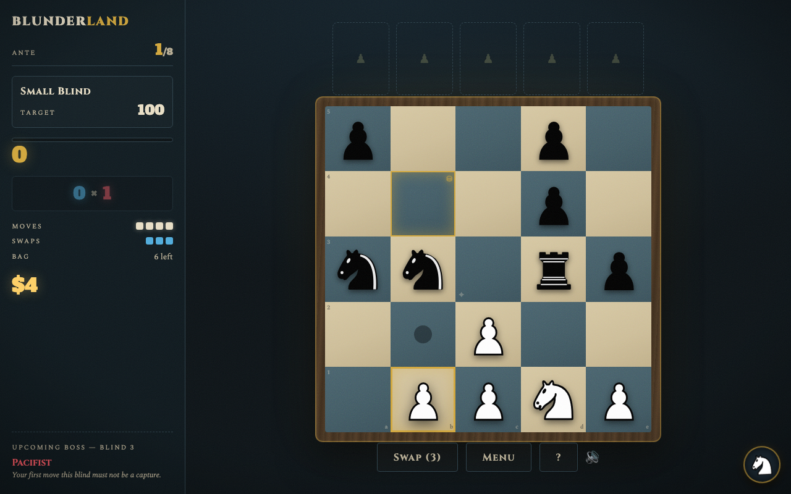
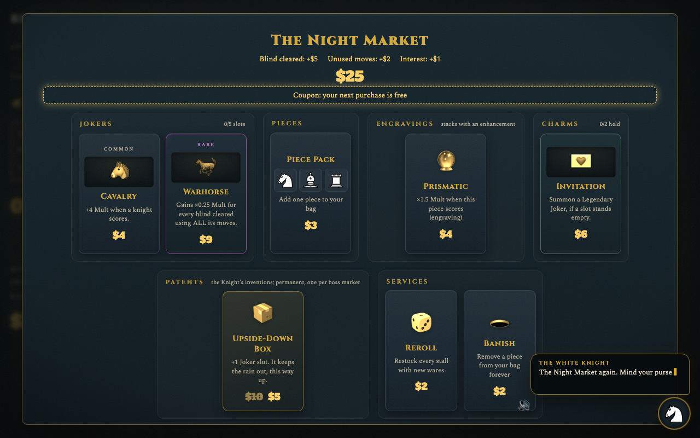
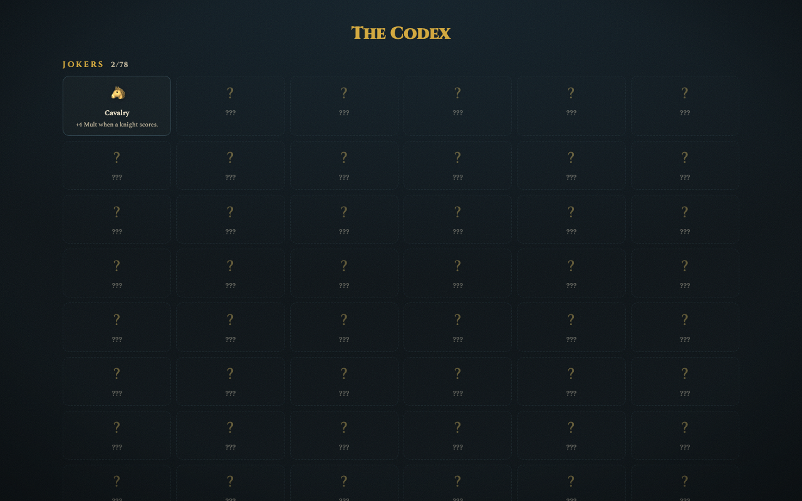

# Blunderland

A **Balatro-style chess roguelike**. Four moves. One target. Break chess before it breaks you.

**▶ [Play it in your browser](https://ari-shtay.github.io/blunderland/)** — runs anywhere, saves locally. Found a bug or have thoughts? [Open an issue](https://github.com/Ari-Shtay/blunderland/issues) or use the in-game "Copy run report" button (seeded runs are perfectly reproducible).

Play chess moves on a 5×5 board to score **Chips × Mult** against escalating blind targets across 8 antes — then ride the win into the Endless Night. Build a bag of pieces instead of a deck, collect jokers that bend the rules, and let the White Knight fall off things so you needn't.



## How a run works

- Your **bag** of pieces is your deck. Each blind deals 5 of them onto ranks 1–2; neutral **bounties** spawn above.
- You get **4 moves** per blind. Every move scores: base chips (mover) + capture chips (bounty) + square bonuses, all × Mult. Underdog rules: a pawn's strike out-earns the queen's — piece choice is the puzzle.
- A moved piece is **spent** for the rest of the blind; **3 swaps** bench a piece for the next in the bag.
- Hit the target before your moves run out — or the run ends, Balatro-style.
- Every 3rd blind is a **boss** with a rule twist, posted a full ante ahead. Small and big blinds carry **Wanted Posters** — skip the blind, forfeit the payout, take the tag.

## The Night Market



- **Jokers** — 78 of them across common / uncommon / rare / legendary, from flat Mult to deep hooks (Insurance survives a failed blind; Mirror Knight copies its neighbor; legendaries answer only to the Invitation charm).
- **Charms** — 17 single-use consumables, most usable mid-blind to steer the puzzle.
- **Pieces, Enhancements & Engravings** — grow the bag, then layer Heavy/Gilded/Volatile with Foiled/Etched/Prismatic/Phantom on the same piece.
- **Patents** — the White Knight sells one of his own inventions in every boss shop. Permanent, in case of bees.
- Money earns interest; rerolls and banishes escalate in price, Balatro-style.

## Openings, Trials, and the rest

- **7 Openings** (decks): from the Classical to the Looking-Glass, where chips and mult are *averaged then squared*. Win to unlock the next.
- **6 Trials** (stakes): cumulative handicaps for players who find winning too comfortable.
- **Endless Night**: after the ante-8 win, targets grow ×2.5 per ante until the arena reclaims you.
- **Seeded runs**: type a number or any phrase on the run picker — same seed, same run.
- **The Codex**: every joker, charm, opening, patent, and poster you've laid eyes on; the rest keep their silhouettes.



## Dev

```bash
npm install
npm run dev      # local dev server
npm run test     # engine unit tests + policy-bot balance gates (vitest)
npm run build    # type-check + production build (dist/, relative paths)
```

## Architecture

- `src/engine/` — pure, fully serializable game logic. No DOM, no `Math.random()`; all randomness flows through a seeded mulberry32 state stored in `RunState`, so runs are reproducible. All tuning numbers live in `constants.ts`.
- `scoreMove` returns an ordered `ScoreEvent[]` script; the UI replays it with staggered timing for the count-up/popup/shake juice (`src/ui/fx.ts`).
- `src/sim/` — a beam-search **policy bot** plays thousands of seeded runs in CI: piece-parity, per-opening difficulty, and clearability gates keep the balance honest (`scripts/balance-report.ts` for the full telemetry).
- `src/ui/` — Preact components; custom 5×5 board renderer; generative lo-fi WebAudio score with a drop-in slot for a real track (`public/music/theme.ogg`). Card art loads from `public/art/` when present, with emoji fallbacks.
- Runs auto-save to localStorage after every action and resume from the menu.

Chess pieces by Colin M.L. Burnett (cburnett set, CC BY-SA 3.0).
